# RAG System Query Flow Diagram

```mermaid
sequenceDiagram
    participant User as 👤 User
    participant Frontend as 🌐 Frontend<br/>(script.js)
    participant API as 🔌 FastAPI<br/>(app.py)
    participant RAG as 🧠 RAG System<br/>(rag_system.py)
    participant AI as 🤖 AI Generator<br/>(ai_generator.py)
    participant Tools as 🔧 Tool Manager<br/>(search_tools.py)
    participant Vector as 📊 Vector Store<br/>(vector_store.py)
    participant Claude as ☁️ Claude API

    User->>Frontend: Types query & clicks send
    Frontend->>Frontend: Disable input, show loading
    Frontend->>API: POST /api/query<br/>{query, session_id}
    
    API->>RAG: query(query, session_id)
    RAG->>RAG: Create session if needed
    RAG->>RAG: Get conversation history
    
    RAG->>AI: generate_response()<br/>+ tools + history
    AI->>AI: Build system prompt<br/>+ conversation context
    AI->>Claude: messages.create()<br/>with tools enabled
    
    alt Claude decides to use search tool
        Claude-->>AI: Response with tool_use
        AI->>Tools: execute_tool("search_course_content")
        Tools->>Vector: search(query, course_name, lesson_number)
        Vector->>Vector: Semantic similarity search<br/>+ course/lesson filtering
        Vector-->>Tools: SearchResults(docs, metadata, distances)
        Tools->>Tools: Format results with context<br/>Store sources
        Tools-->>AI: Formatted search results
        AI->>Claude: Follow-up call with tool results
        Claude-->>AI: Final synthesized response
    else Claude uses general knowledge
        Claude-->>AI: Direct response
    end
    
    AI-->>RAG: Generated answer
    RAG->>Tools: get_last_sources()
    Tools-->>RAG: Sources list
    RAG->>RAG: Update conversation history
    RAG->>Tools: reset_sources()
    RAG-->>API: (answer, sources)
    
    API-->>Frontend: QueryResponse<br/>{answer, sources, session_id}
    Frontend->>Frontend: Remove loading animation
    Frontend->>Frontend: Convert markdown to HTML<br/>Display with sources
    Frontend->>User: Show response + sources
```

## Key Components & Data Flow

### 1. **Frontend Layer** (`script.js`)
- **Input Handling**: User interaction, form validation
- **API Communication**: HTTP requests to backend
- **UI Updates**: Loading states, message display, markdown rendering
- **Session Management**: Tracks session_id for conversation continuity

### 2. **API Layer** (`app.py`)
- **Request/Response Models**: Pydantic validation
- **Session Coordination**: Creates sessions if needed
- **Error Handling**: HTTP exceptions and status codes
- **RAG Orchestration**: Delegates to RAG system

### 3. **RAG System** (`rag_system.py`)
- **Query Orchestration**: Coordinates all components
- **Session Management**: Conversation history tracking
- **Tool Integration**: Provides search capabilities to AI
- **Source Aggregation**: Collects and resets source information

### 4. **AI Generator** (`ai_generator.py`)
- **Claude Integration**: API calls with tool support
- **Tool Execution**: Handles tool_use responses
- **Context Building**: System prompts + conversation history
- **Response Synthesis**: Combines tool results with AI reasoning

### 5. **Search Tools** (`search_tools.py`)
- **Tool Definitions**: Schema for Claude's tool calling
- **Search Execution**: Delegates to vector store
- **Result Formatting**: Adds course/lesson context
- **Source Tracking**: Captures sources for UI display

### 6. **Vector Store** (`vector_store.py`)
- **Semantic Search**: ChromaDB + sentence-transformers
- **Filtering**: Course/lesson specific queries
- **Document Retrieval**: Returns relevant chunks with metadata
- **Similarity Scoring**: Distance-based relevance ranking

## Decision Points

1. **Claude's Tool Usage**: AI autonomously decides whether to search or use general knowledge
2. **Search Filtering**: Optional course_name and lesson_number parameters
3. **Session Creation**: New sessions created automatically when missing
4. **Error Handling**: Each layer provides fallbacks and error messages
5. **Source Display**: UI shows collapsible sources when available

## Performance Optimizations

- **Async Frontend**: Non-blocking UI with loading states
- **Tool Caching**: Vector embeddings cached in ChromaDB
- **Session Persistence**: Conversation history maintained server-side
- **Batch Processing**: Multiple tool calls handled efficiently
- **Smart Chunking**: Sentence-based text segmentation with overlap